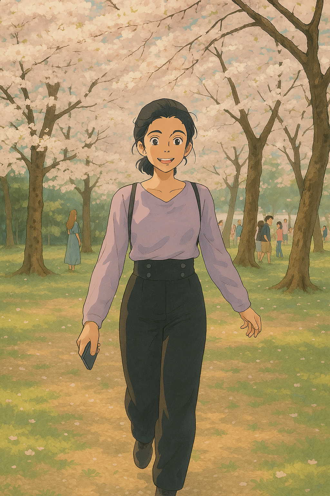

# 🎨 Ghibli-Style Image Generator

This project uses **Stable Diffusion** and a **Studio Ghibli-style LoRA** to transform photos into Ghibli-inspired anime artwork. Built with 🤗 Diffusers and Gradio, the app runs locally and is GPU-accelerated for faster image generation.

---

## 🚀 Features

- Upload a photo and transform it into anime-style art
- Uses the [Studio Ghibli Style LoRA](https://civitai.com/models/6526/studio-ghibli-style-lora) from Civitai
- GPU-powered with NVIDIA RTX 4070 Ti
- Outputs are automatically saved to a local folder
- Simple and intuitive UI built with Gradio

---
## 📁 Folder Structure
```bash 
ghibli-style-image-generator/
│ 
├── ghibli_generator.py # Main app script 
├── requirements.txt # Python dependencies 
├── README.md # Project documentation 
├── generated_images/ # Folder for saved outputs 
└── lora/ghibli_lora.safetensors
```
---

## ⚙️ Setup Instructions

1. Clone this repository
```bash
git clone https://github.com/yourusername/ghibli-style-image-generator.git
cd ghibli-style-image-generator
```
2. (Optional) Create and activate a virtual environment
```bash 
python -m venv venv
# On Windows:
venv\Scripts\activate
# On macOS/Linux:
source venv/bin/activate
```

3. Install dependencies from `requirements.txt`
```bash 
pip install -r requirements.txt
```

4. Download the LoRA and place it in the `lora/` directory
# Go to https://civitai.com/models/6526/studio-ghibli-style-lora
# Place the downloaded .safetensors file inside the lora/ folder

5. Run `ghibli_generator.py` and open the Gradio app in your browser
``` bash 
python ghibli_generator.py
```
---

## 🖼️ Sample Output

> Generation time: ~5 minutes per image on an NVIDIA RTX 4070 Ti (initial run; later runs may be faster).

<p align="center">
  
</p>

---

## 🔧 Tech Stack

- Python 3.11
- PyTorch (with CUDA)
- 🤗 Hugging Face Diffusers
- Gradio for UI
- PEFT & LoRA support
- LoRA model: [Studio Ghibli Style](https://civitai.com/models/6526/studio-ghibli-style-lora)

---

## 💡 Future Plans

- Add download button in the UI
- Deploy to Hugging Face Spaces or Streamlit Cloud
- Allow real-time prompt editing
- Add webcam input support

---

## 📜 License
MIT License. Use freely and modify as needed.